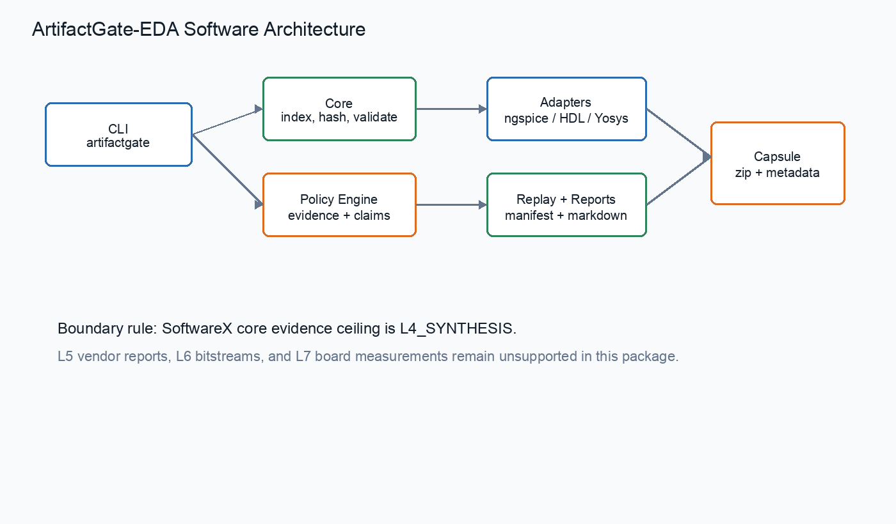
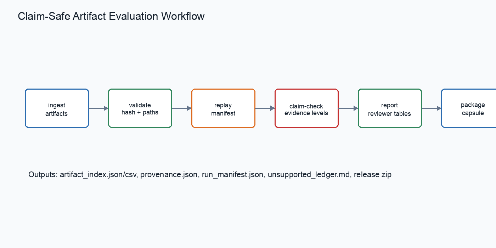
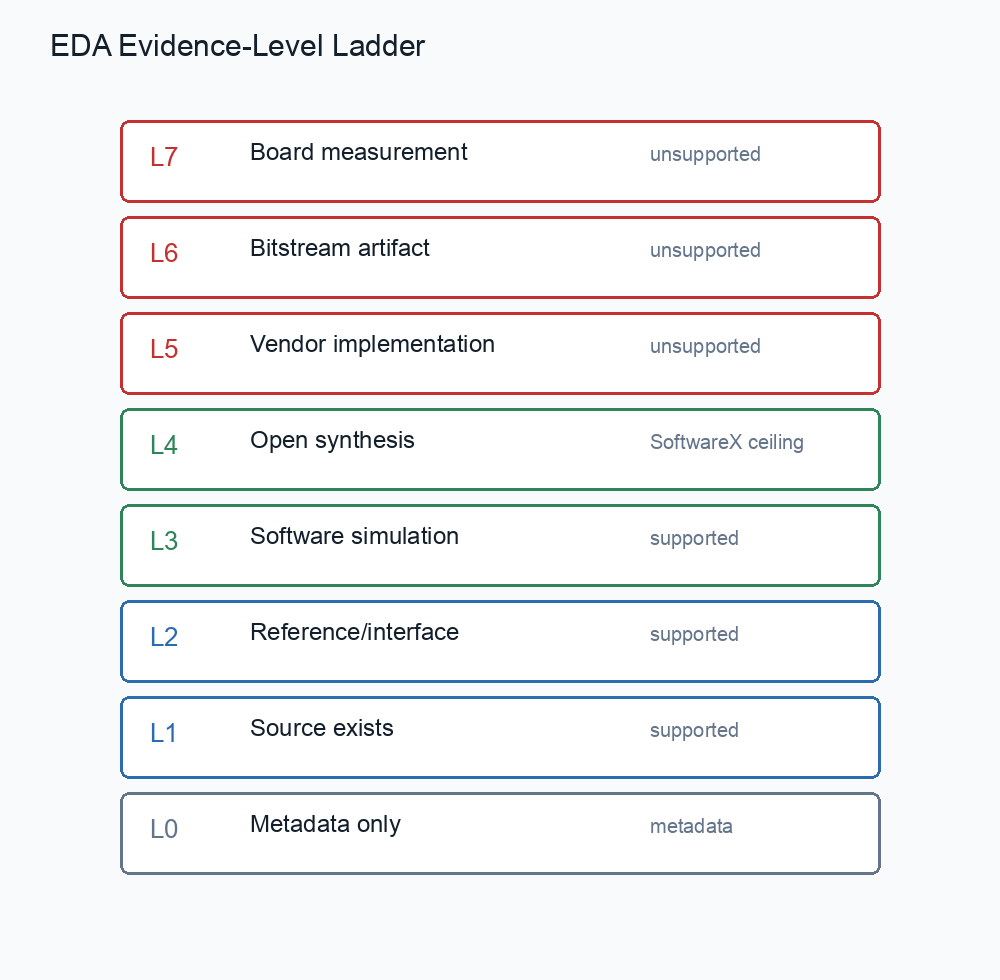
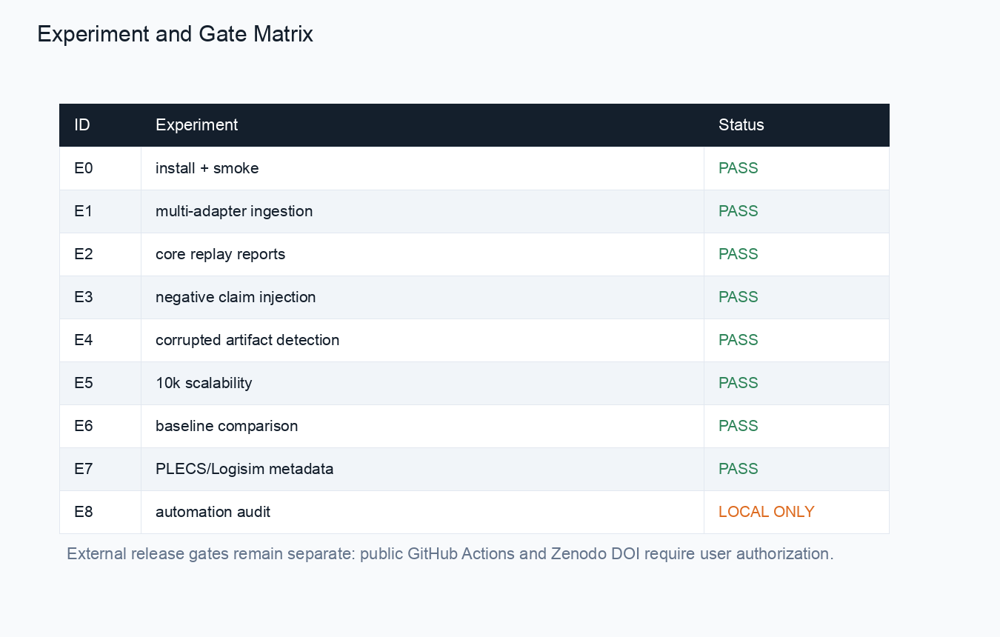

# ArtifactGate-EDA: An Adapter-Based Claim-Safe Artifact Evaluation Framework for Software-Only EDA Experiments

## Abstract

ArtifactGate-EDA is an open-source Python framework for claim-safe artifact
evaluation in software-only EDA experiments. It converts heterogeneous EDA
experiment folders into portable artifact packages with provenance records,
SHA-256 hashes, replay manifests, evidence-level labels, claim-evidence tables,
unsupported-claim ledgers, and reviewer-readable reports. The current release
supports bounded adapters for ngspice-style SPICE artifacts, Icarus/VVP HDL
simulation artifacts, Yosys synthesis artifacts, Verilator logs, and
metadata-only PLECS and Logisim artifacts. Local evaluation exercises
installation, command-line behavior, multi-adapter ingestion, replay package
generation, negative claim injection, corrupted artifact detection, synthetic
scalability outputs, and a baseline comparison against simpler artifact
management approaches. ArtifactGate-EDA does not validate hardware, Vivado
timing, DFX deployment, bitstreams, or board-level behavior. Its purpose is to
make the software evidence boundary explicit so that simulation or synthesis
artifacts are not promoted into stronger claims.

## Highlights

- Claim-safe artifact packaging for software-only EDA experiments.
- Adapter-based ingestion for ngspice, HDL simulation, and Yosys evidence.
- Negative claim tests block unsupported stronger evidence claims.

## Metadata

| Nr | Code metadata description | Metadata |
|---|---|---|
| C1 | Current code version | 0.1.2 |
| C2 | Permanent link to code/repository used for this code version | https://github.com/KKKKJ687/ArtifactGate-EDA |
| C3 | Legal code license | Apache-2.0 |
| C4 | Code versioning system used | git |
| C5 | Software code languages, tools and services used | Python, Makefile, GitHub Actions, ngspice-style artifacts, Icarus/VVP-style artifacts, Yosys-style artifacts |
| C6 | Compilation requirements, operating environments and dependencies | Python >=3.10; dependencies listed in `pyproject.toml`; core replay does not require commercial EDA software |
| C7 | Developer documentation/manual | `README.md` and `docs/` in the repository |
| C8 | Support email for questions | Pending author-side release metadata |

## Motivation And Significance

EDA research artifacts are frequently assembled from source files, simulator
logs, synthesis reports, tables, scripts, informal notes, and paper claims. A
reviewer or future author must determine which claims are directly supported by
the package and which claims would require a stronger evidence layer. In
software-only experiment packages, this distinction is especially important:
source files, simulation logs, and open-source synthesis reports can support
artifact-level replay and inspection, but they cannot by themselves support
hardware, vendor implementation, bitstream, or board-level claims.

ArtifactGate-EDA addresses this packaging problem as research software rather
than as a new EDA algorithm. Its central abstraction is an evidence-layered
artifact record. Each indexed file receives a relative path, artifact type,
hash, tool label, adapter label, evidence level, claim binding, unsupported
boundary, and creation command. These records are then used to build replay
manifests, validation reports, claim-evidence tables, unsupported-claim ledgers,
and release capsules. The resulting package is intended to make review
questions concrete: which files exist, how they were indexed, which evidence
level they support, and which claims should be rewritten or rejected.

The scope is intentionally narrow. The SoftwareX core is limited to
software-level and open-source synthesis evidence up to `L4_SYNTHESIS`.
Vendor-implementation, bitstream, and board-measurement layers are represented
as unsupported boundaries, not as positive results. This conservative scope is
part of the contribution because it prevents a reproducibility package from
appearing stronger than its available evidence.

## Software Description

The package is organized around seven core command-line operations:
`ingest`, `validate`, `replay`, `claim-check`, `report`, `package`, and
`compare`. These commands are backed by a small file-oriented Python API under
`artifactgate_eda.core`. The implementation does not require a service,
database, commercial EDA installation, Codex, or MCP runtime for the core
reproduction path. Reviewers can run the Makefile targets and inspect the
generated JSON, CSV, Markdown, and ZIP outputs directly.

The ingest path walks an example directory through a selected adapter, filters
files by adapter-specific extensions, copies accepted artifacts into a package
directory, computes SHA-256 digests, assigns evidence levels, and writes
`artifact_index.json`, `artifact_index.csv`, and `provenance.json`. The validate
path checks missing artifacts, hash drift, missing evidence levels, missing tool
version fields, broken claim references, and non-portable local paths. Replay
creates a software-only run manifest, resolved manifest, replay summary,
acceptance report, claim policy, unsupported ledger, and validation report.

The adapter layer currently covers six bounded evidence sources in the release
tests. The core adapters are `ngspice`, `icarus`, `yosys`, and `verilator`.
Metadata-only supplementary adapters cover `plecs` and `logisim`; `ltspice`
and `vivado_stub` are kept as optional or schema-only boundaries rather than
core evidence for stronger claims. This adapter design lets the package ingest
heterogeneous EDA folders while keeping the claim ceiling explicit.

The claim-safety engine uses policy files under
`repo/src/artifactgate_eda/policies/`. The evidence-level policy defines the
meaning of each layer from metadata through board measurement. The
forbidden-claim policy lists phrases and classes that are unsupported in the
current SoftwareX core, including hardware, vendor implementation, DFX,
bitstream, board-level, and publication-readiness overclaims. The
claim-check command reports unsupported claims and writes a safe rewrite
suggestion when a claim exceeds the available evidence.

## Illustrative Examples

The repository includes bounded examples for ngspice-style SPICE artifacts,
HDL/Icarus simulation artifacts, Yosys synthesis artifacts, Verilator logs,
PLECS metadata-only artifacts, and Logisim metadata-only artifacts. The examples
are deliberately small so that the package can be inspected quickly, while the
supplementary package carries larger source-derived tables and generated
reports.

The local experiment matrix is generated by `make reproduce-all` and checked
again by `make preflight`. Multi-adapter ingestion currently indexes 4 ngspice
artifacts, 10 Icarus artifacts, 12 Yosys artifacts, 3 Verilator artifacts, 3
PLECS metadata artifacts, and 2 Logisim metadata artifacts. All indexed
artifacts in those local examples have recorded hashes, evidence levels, and
claim-binding fields. Replay packaging generates manifest-backed packages for
the ngspice, Icarus, Yosys, and Verilator examples without requiring hardware
access or commercial dependencies in the core path.

The negative claim suite injects 52 dangerous claims into the claim checker.
After policy evaluation, all 52 are classified as unsupported and all receive
safe rewrite suggestions. The corrupted artifact suite checks seven expected
failure modes: missing files, hash mismatch, missing tool-version metadata,
broken claim references, non-portable paths, simulation-to-hardware escalation,
and Yosys-to-vendor-timing escalation. Synthetic scalability outputs are
generated for 1k, 3k, 5k, and 10k artifact rows; the 10k case is reported as a
local validation pass with synthetic timing and memory summaries. These results
are used as software-package smoke evidence, not as performance or hardware
claims.

The baseline comparison contrasts ArtifactGate-EDA with a manual ZIP archive, a
shell-script replay folder, and a checksum manifest. The comparison is
qualitative and package-oriented: ArtifactGate-EDA combines hash checking,
evidence-level labels, claim checking, replay manifests, unsupported ledgers,
and SoftwareX-oriented reporting in one workflow, while the simpler baselines
cover only subsets of those functions.

## Impact

ArtifactGate-EDA is intended for authors and reviewers who need to audit EDA
artifact packages without turning software evidence into stronger experimental
claims. The software makes the artifact package more inspectable by preserving
hashes, relative paths, adapter labels, evidence levels, and replay commands in
machine-readable files. It also makes unsupported claims visible through a
separate ledger rather than burying them in prose.

For authors, this reduces the chance that an artifact package will accidentally
overstate what has been checked. For reviewers, it provides a compact path from
source folder to artifact index, replay manifest, claim-evidence table, and
release capsule. For future extensions, the adapter interface provides a place
to add stronger evidence layers, but only when the corresponding artifacts and
validation reports exist.

## Conclusions

ArtifactGate-EDA packages heterogeneous software-only EDA artifacts into
hash-recorded, replay-checkable, and claim-auditable bundles. The release
provides an installable Python package, command-line tools, examples, tests,
generated reports, documentation, a supplementary artifact package, a public
GitHub release, and a Zenodo DOI. Local evaluation covers installation,
multi-adapter ingestion, replay package generation, negative claim injection,
corrupted artifact detection, synthetic scalability outputs, and artifact
management baseline comparison. The main contribution is a conservative
software layer for making evidence boundaries explicit.

## Limitations

ArtifactGate-EDA does not validate hardware, Vivado timing, DFX deployment,
bitstreams, or board-level behavior. The current examples are bounded and
software-only. The scalability outputs are synthetic package checks rather than
full performance benchmarks. Metadata-only adapters do not prove executable
tool flows. Any future stronger claim would require new evidence layers,
separate artifacts, and separate validation beyond this SoftwareX core release.

## Availability

Repository: https://github.com/KKKKJ687/ArtifactGate-EDA. The v0.1.2 archived
release DOI will be finalized after Zenodo processes the v0.1.2 GitHub release.

## Author-Side Submission Metadata

Support email, funding statement, competing-interest statement, and CRediT
roles remain pending author-side confirmation. They are tracked in
`docs/author_submission_metadata_request.md` and should be completed before
journal submission.
